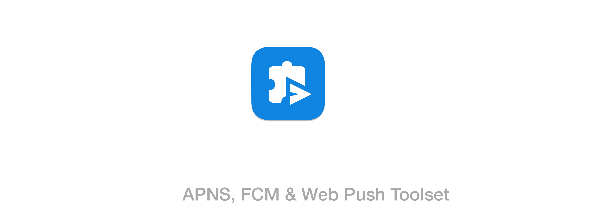

[](https://github.com/haithngn/remotify/actions/workflows/build_windows.yaml) [](https://github.com/haithngn/remotify/actions/workflows/build_osx.yaml) [](https://github.com/haithngn/remotify/actions/workflows/build_linux.yaml)




**Remotify** is a tool for sending remote notifications via **Apple Push Notification Service (APNs)** and **Google Firebase Cloud Messaging (FCM)**. It is designed to streamline the process of sending notifications directly to mobile devices for several purposes, such as debugging, testing, marketing & advertising experiments, and more.


---

## 🚀 Features

- Support multiple platforms including Mobile (Android/iOS) and Web Push.
- Support for sending notifications using Apple **APNs** and Google **FCM**.
- Support both APNs **Token-base** and **Legacy**.
- Payload editor for customizing notification content.
- History of sent notifications for easy reference.
- Easy-to-use interface for sending notifications.
- **Dark Mode** for a more immersive experience.

---

## 📥 Installation

You can install Remotify in two ways:

### 1. MacOS
#### 1.1 Homebrew
```bash
brew install remotify
```
---
#### 1.2 Manual Install
Download the installer from the [Releases Page](https://github.com/haithngn/remotify/releases) and run it.
### 2. Linux
Download the binary from the [Releases Page](https://github.com/haithngn/remotify/releases) and run it.
```bash
chmod +x remotify
./remotify
```
### 3. Windows
Download the NSIS binary from the [Releases Page](https://github.com/haithngn/remotify/releases) and run it.

### 4. Compile from Source
Clone the repository and run the following commands:
```bash
wails dev
```
You need to install development tools to compile the project, see [Technologies Used](#🛠️-technologies-used) for more details.

# Roadmap
| Feature | Description                                                                                              | Status   |
|---|----------------------------------------------------------------------------------------------------------|---|
| Preview | Display a preview of the notification on emulated device screen(s).                                      | **In Progress** |
| Generate Code | Generate implementation code for both client and server side.                                            | **To Do** |
| Built-in Functions | A try-it-out feature let anyone can push and see the result on real devices without creating Mobile app. | **To Do** |

Feel free to contribute your ideas and suggestions on our [tickets](https://github.com/haithngn/remotify/issues).


---

## 🛠️ Technologies Used

- **[Golang 1.2x+](https://golang.org/)** – Standard Go Application.
- **[Wails 2.x](https://wails.io/)** – Desktop application framework.
- **[Vue.js 3.x](https://vuejs.org/)** – Frontend development.
- **[Bootstrap 5.x](https://getbootstrap.com/)** – CSS framework.
- **[Vite 3.x](https://vitejs.dev/)** – Frontend build tool.

---

## 🤝 Contributing

Let's share your code with us to make Remotify more useful!
Join us to resolve issues, provide feedback, and help us improve the project.


---

## 📜 License

This project is licensed under the **MIT License**. See the [LICENSE](LICENSE) file for details.
